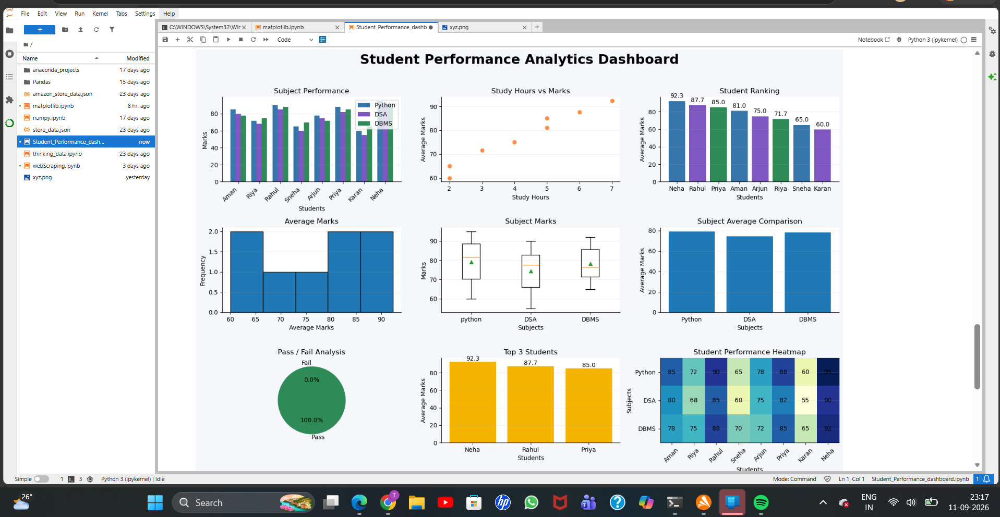

# 📊 Student Performance Analytics Dashboard

A Python-based **Student Performance Analytics Dashboard** created using **Jupyter Notebook, NumPy, and Matplotlib**.

This project analyzes student academic performance through different data visualizations such as subject-wise performance, student rankings, study hours, average marks, pass/fail analysis, and performance heatmaps.

## 📌 Project Overview

The dashboard analyzes the performance of **8 students** across three subjects:

* 🐍 Python
* 💻 DSA
* 🗄️ DBMS

It also analyzes the relationship between **study hours and average marks** and identifies the **top-performing students**.

## 📊 Dashboard Preview



## ✨ Features

* 📊 Subject-wise Performance Analysis
* 📈 Study Hours vs Average Marks
* 🏆 Student Ranking
* 📉 Average Marks Distribution
* 📦 Subject Marks Boxplot
* 📊 Subject Average Comparison
* 🥧 Pass/Fail Analysis
* 🥇 Top 3 Students
* 🔥 Student Performance Heatmap

## 📈 Visualizations

### 1. Subject Performance

Compares Python, DSA, and DBMS marks for each student.

### 2. Study Hours vs Performance

Shows the relationship between students' study hours and their average marks.

### 3. Student Ranking

Ranks students according to their average marks from highest to lowest.

### 4. Average Marks Distribution

A histogram showing the distribution of students' average marks.

### 5. Subject Marks Boxplot

Compares the distribution of marks across Python, DSA, and DBMS.

### 6. Subject Average Comparison

Compares the overall average marks of Python, DSA, and DBMS.

### 7. Pass/Fail Analysis

Shows the proportion of students who passed and failed based on the defined passing marks.

### 8. Top 3 Students

Displays the three highest-performing students based on their average marks.

### 9. Performance Heatmap

Provides a visual comparison of student marks across Python, DSA, and DBMS.

## 🛠️ Technologies Used

* Python
* NumPy
* Matplotlib
* Jupyter Notebook

## 📂 Project Files

### `Student_dashboard.ipynb`

Contains the complete Python code, dataset, calculations, and visualizations used to create the dashboard.

### `dashboard.png`

A preview image of the final Student Performance Analytics Dashboard.

## ▶️ How to Run

### 1. Clone the Repository

```bash
git clone https://github.com/TasneemFatma012/Student-Performance-Analytics-Dashboard.git
```

### 2. Navigate to the Project

```bash
cd Student-Performance-Analytics-Dashboard
```

### 3. Install Required Libraries

```bash
pip install numpy matplotlib jupyter
```

### 4. Open the Notebook

```bash
jupyter notebook Student_dashboard.ipynb
```

You can also open the notebook using **JupyterLab**.

### 5. Run the Cells

Run all the cells in the notebook to generate the Student Performance Analytics Dashboard.

## 🎯 Learning Objectives

Through this project, I practiced:

* Python data visualization
* NumPy operations
* Matplotlib
* Data sorting and ranking
* Average calculations
* Statistical visualization
* Multiple chart types
* Dashboard design
* Data analysis

## 🚀 Future Improvements

* Add CSV/Excel data input
* Add interactive charts
* Add student filtering
* Add more subjects
* Add automated performance reports
* Add student-wise detailed analysis
* Convert the dashboard into a web-based application

## 👩‍💻 Author

**Tasneem Fatma**

MCA Student | Python | Data Visualization | Web Development

## ⭐ Conclusion

This project demonstrates how **Python, NumPy, and Matplotlib** can be used to analyze student academic data and present meaningful insights through data visualization.
